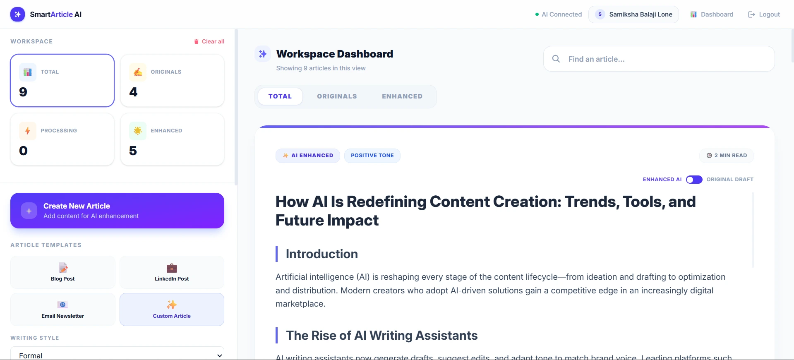
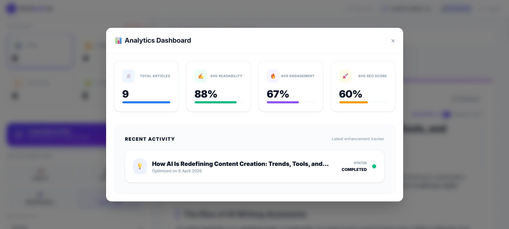

# Smart AI Articles — AI-Powered Content Creation Platform

> A full-stack MERN application designed to streamline article creation, editing, and optimization through advanced AI models.

## 🔗 Links
- **Live Demo**: [https://beyondchats-frontend-beta.vercel.app/](https://beyondchats-frontend-beta.vercel.app/)
- **GitHub Repository**: [https://github.com/Samiksha-Lone/Smart-AI-Articles](https://github.com/Samiksha-Lone/Smart-AI-Articles)

## Overview

Smart AI Articles is a centralized platform for content creators and writers. It leverages the power of Large Language Models (LLMs) to help users generate, refine, and analyze content across various formats like blogs, social media, and professional emails.

## Problem Statement

- **Content Bottlenecks**: Writers often struggle with "writer's block" or spend excessive time on initial drafts.
- **Inconsistent Quality**: Maintaining a consistent tone and optimizing for SEO/readability across multiple pieces is challenging.
- **Synchronous Delays**: Generating high-quality AI content can be slow, blocking the user interface during processing.

## Solution

Smart AI Articles solves these challenges by providing an AI-enhanced editor with pre-built templates and real-time analytics. It uses Google Gemini to intelligently enhance content and provide actionable quality insights.

## Key Features

- 🔐 **Secure Authentication** — JWT-based user registration and login with bcrypt-encrypted passwords and session management.
- ✍️ **AI-Powered Enhancement** — Intelligent content enhancement using Google Gemini with customizable writing styles and tones.
- 📋 **Content Templates** — Pre-built templates for Blog posts, LinkedIn updates, Professional Emails, and Custom formats to accelerate content creation.
- 📊 **Real-Time Analytics Dashboard** — Comprehensive insights including readability scores, engagement metrics, and SEO optimization analysis for each article.
- 🔄 **Version Control & Comparison** — Toggle between original and enhanced content, regenerate versions, and track all modifications with timestamps.
- 🔍 **Advanced Search & Filtering** — Search articles by title/content, filter by status, with pagination support.
- 📝 **Original vs Enhanced Toggle** — Side-by-side comparison of AI-enhanced content with original drafts, with one-click copy to clipboard.
- 📱 **Modern Responsive UI** — Premium, high-performance interface built with React 19 and Tailwind CSS 4, optimized for desktop and mobile devices.
- ⚡ **Background Processing** — Asynchronous AI enhancement with real-time status tracking and auto-refresh when processing completes.

## Tech Stack

| Layer | Technology |
|---|---|
| **Frontend** | React 19, Vite, Tailwind CSS 4, Axios, React Icons |
| **Backend** | Node.js, Express.js, Mongoose |
| **Database** | MongoDB Atlas with full CRUD operations |
| **AI Models** | Google Generative AI (Gemini), Ollama (local fallback) |
| **Security** | JWT tokens, bcrypt password hashing, Helmet.js, rate-limiting |
| **Deployment** | Vercel (frontend), Render/Heroku ready (backend) |

## Architecture / Flow

```text
User → React Frontend → Axios → Express API → MongoDB
                                      ↓
                           Google Gemini / Ollama
```

## My Contribution

**I independently designed and built this entire project from scratch**, including:

- 🖥️ **Frontend** — Responsive React UI with state management, real-time analytics dashboard, dynamic content rendering with proper HTML formatting, and mobile optimization.
- ⚙️ **Backend** — RESTful API with secure authentication, MongoDB integration, pagination, search/filter functionality, and comprehensive error handling.
- 🤖 **AI Integration** — Gemini-powered content enhancement with automatic HTML/markdown conversion, fallback error handling, and structured response parsing.
- 📊 **Analytics** — Dashboard metrics for total articles, originals, processing status, enhanced articles, and average AI quality scores.
- 🔐 **Security** — JWT-based session management, password encryption, rate limiting, and input validation.
- 🚀 **Deployment** — Production-ready environment configuration with Vercel frontend hosting support.

## Setup

### Prerequisites
Node.js 18+, npm, MongoDB Atlas account, Gemini API key.

### 1. Backend

```bash
cd backend
npm install
```

Create a `.env` file in the `backend` directory:

```env
PORT=3000
MONGODB_URI=mongodb+srv://<your-cluster>
JWT_SECRET=your_secret_key
GEMINI_API_KEY=your_gemini_api_key
OLLAMA_BASE_URL=http://localhost:11434
```

```bash
npm run dev   # http://localhost:3000
```

### 2. Frontend

```bash
cd frontend
npm install
```

Create a `.env` file in the `frontend` directory:

```env
VITE_API_URL=http://localhost:3000/api
```

```bash
npm run dev   # http://localhost:5173
```

## Screenshots

### Home Page


### Content Dashboard


## Future Improvements

- [ ] Collaborative editing features for real-time team content creation.
- [ ] Integration with Medium and LinkedIn APIs for direct one-click publishing.
- [ ] Advanced SEO recommendation engine with competitor keyword analysis.
- [ ] Multi-language support for content translation and localization.

## License

MIT License — see [LICENSE](LICENSE) for details.

## Credits

**Developed by [Samiksha Lone](https://github.com/Samiksha-Lone)**